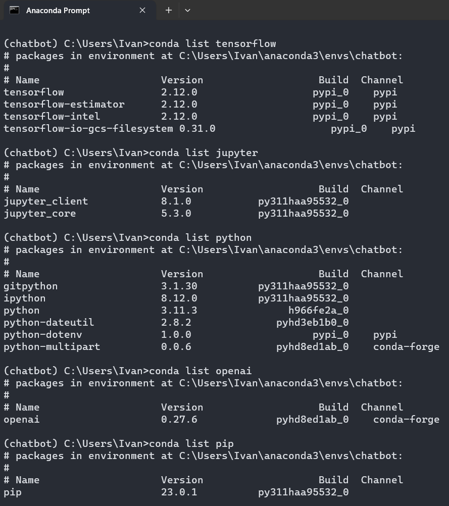
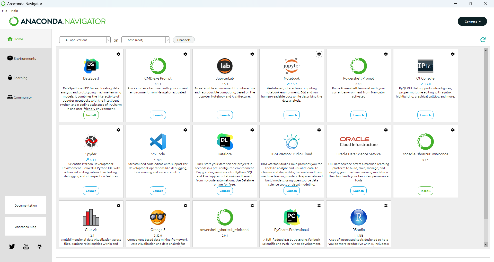
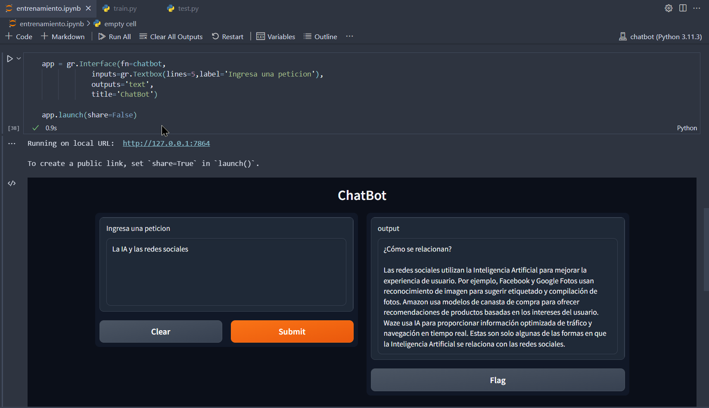
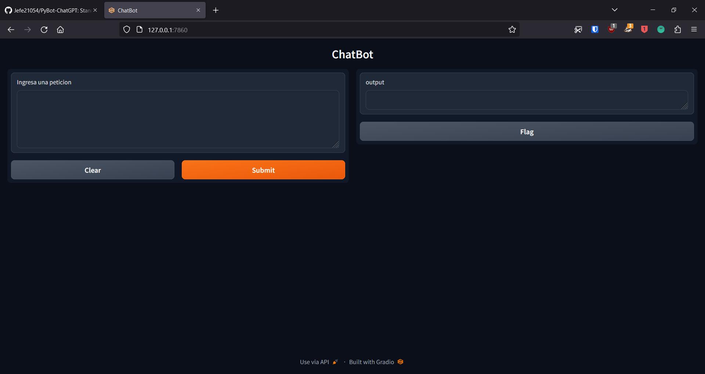
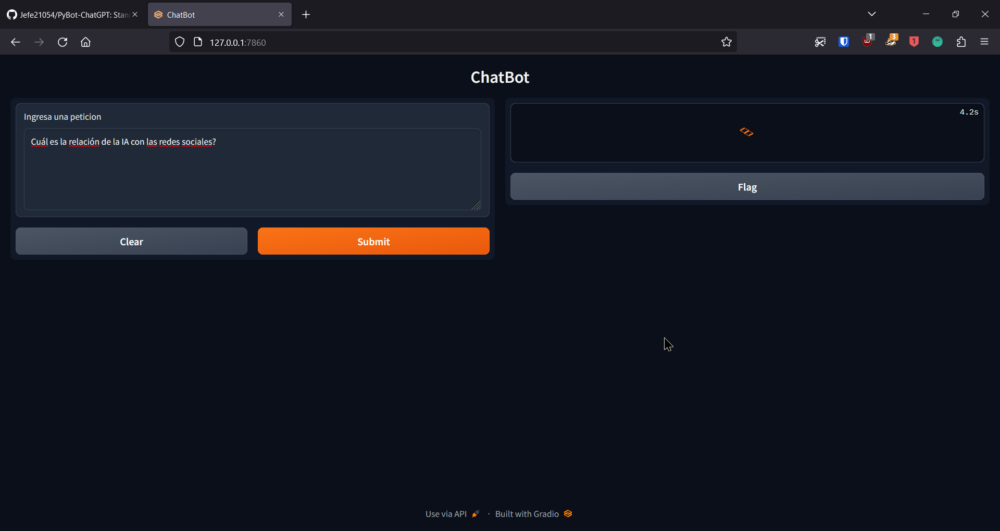
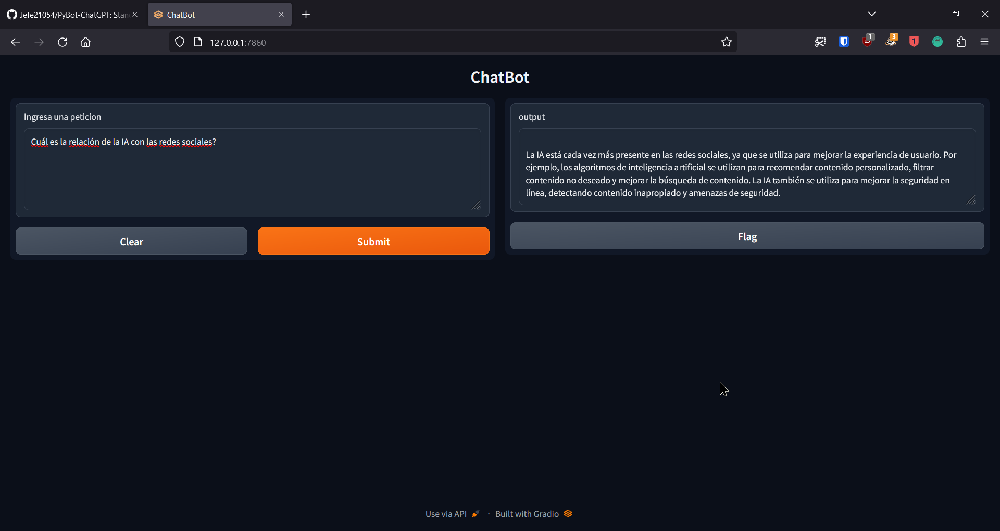

# PyBot-ChatGPT
Stand out in the AI market by programming custom chatbots with Python and the ChatGPT API.

## Screenshots

### Anaconda Virtual Environment

1. Anaconda Environment CLI view
   

2. Anaconda Navigator GUI
   

### Project Working with Jupyter Notebooks

1. Chatbot in Jupyter Notebook
   

### Project Working in the Browser with Gradio

1. Chatbot Interface in the Browser
   

2. Example Question processing in the Browser
   

3. Interactive Chatbot Experience in the Browser
   

## Getting Started

To get started with this chatbot project, follow the instructions below.

### Prerequisites

- Python 3.x
- Anaconda

### Setup

1. Clone this repository to your local machine:

   ```bash
   git clone https://github.com/Jefe21054/PyBot-ChatGPT.git
   ```

2. Create a new Anaconda virtual environment:

   ```bash
   conda create --name chatbot python
   ```

3. Activate the virtual environment:

   ```bash
   conda activate chatbot
   ```

4. Install the required dependencies:

   ```bash
   pip install -r requirements.txt
   ```

5. Configure OpenAI API credentials in a `.env` file. You should have something like this:

   ```
   OPENAI_API_KEY='YOUR_OPENAI_API_KEY'
   ```

6. Launch the Jupyter Notebook:

   ```bash
   jupyter-notebook
   ```

7. Open the `entrenamiento.ipynb` notebook in Jupyter and run the cells to interact with the chatbot.

## Running the Chatbot in the Browser with Gradio

1. Ensure the Anaconda virtual environment is activated:

   ```bash
   conda activate chatbot
   ```

2. Start the Gradio interface:

   ```bash
   python test.py
   ```

3. Access the chatbot interface in your browser at `http://127.0.0.1:7864`.

## OpenAI API Documentation

For more information on the OpenAI API and how to use it in your projects, please refer to the [OpenAI API Documentation](https://docs.openai.com/).

## Contributing

Contributions are welcome! If you have any ideas or suggestions, please open an issue or submit a pull request.

## License

This project is licensed under the [GPL-3.0 License](LICENSE).